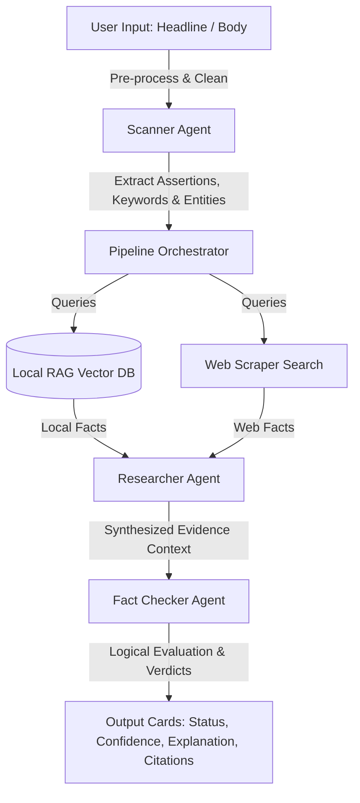

# 🛡️ VeriTruth: Agentic RAG Fake News Detection System

VeriTruth is a production-grade, modular, and extensible Retrieval-Augmented Generation (RAG) system engineered in Python to evaluate the authenticity of news headlines and articles. By coordinating a pipeline of intelligent agents (Scanner, Researcher, and Fact Checker) backed by DuckDuckGo scraping retrievers and a persistent vector database (ChromaDB), the system provides detailed truth audit assessments, confidence metrics, and citation references.

---

## 📖 Project Overview

In an era of information overload and synthetic media, verifying claims is a critical bottleneck. VeriTruth automates this process through an **Agentic RAG workflow**. Instead of querying a large language model directly, which is prone to hallucinations, VeriTruth decomposes claims, fetches evidence from reputable sources and local databases, evaluates facts programmatically, and renders reasoning paths with zero-hallucination grounding constraints.

---

## 🚀 Features

- **Pre-processing Scanner Agent**: Pre-processes inputs (whitespace sanitization, lowercase standardization, and special character stripping), extracts critical keywords and named entities (people, places, organizations), and splits articles into testable assertions.
- **Pluggable Search Infrastructure**: Employs an interface-driven research layout. Includes a default requests-based scraping search engine prioritizing trusted domains (e.g., Reuters, AP, BBC) that can be swapped for paid APIs (e.g., Tavily, Serper) later.
- **ChromaDB Vector Store (RAG)**: Integrates a persistent local knowledge base using Google's `text-embedding-004` embedding model to query uploaded documents and manual reference entries.
- **Strict Fact-Checking Verdicts**: Limits Gemini to exactly four verification classifications:
  - `True`: Fully supported by the retrieved evidence.
  - `False`: Directly contradicted by the retrieved evidence.
  - `Misleading`: Partially true but ignores context, distorts details, or mixes truth with false claims.
  - `Insufficient Evidence`: Assigned when the retrieved context is weak, missing, or inconclusive.
- **Dual Runtime Interface**:
  - **Streamlit Web Dashboard**: Features visual step spinners, progress counters, custom layout cards, and dynamic document upload modules.
  - **Command-Line Interface (CLI)**: Supports single-query parameters and shell interactive modes for quick checks and background automation scripts.
- **Robust Exception Logging**: Unified dual-channel logger writing to stdout and `app.log` with complete tracebacks for debugging.

---

## 🏗️ Architecture

The system executes a serial agent-choreography workflow:



---

## 📁 Folder Structure

```text
c:/Agentic Rag for Dummies/
├── config/
│   ├── __init__.py
│   ├── settings.py          # Environment parameter loader delegates
│   └── prompts.py           # Centralized system instructions and prompt templates
├── utils/
│   ├── __init__.py
│   ├── logging.py           # Console and file logger initializer
│   └── search.py            # DuckDuckGo fallback query helpers
├── agents/
│   ├── __init__.py
│   ├── base.py              # Parent class initializing Gemini API connections
│   ├── scanner_agent.py     # Cleans text, extracts keywords/entities, and parses claims
│   ├── researcher_agent.py  # Pluggable scraper search engine & synthesis reporter
│   └── fact_checker.py      # Executes logical verdict matching (True/False/etc.)
├── backend/
│   ├── __init__.py
│   ├── rag_engine.py        # Local vector store embedding and retrieval manager (ChromaDB)
│   └── orchestrator.py      # Pipeline director yielding execution status stream generators
├── frontend/
│   ├── __init__.py
│   └── app.py               # Streamlit web dashboard interface
├── tests/
│   └── test_system.py       # Configuration and logic execution unit test suite
├── .env                  # Environment variables containing API key configuration
├── .env.template            # Environment skeleton file
├── app_config.py            # Primary dotenv configurations loader
├── config.py                # Namespace conflict safety forwarder
├── main.py                  # CLI and interactive prompt shell runner
├── requirements.txt         # Project package requirements
└── README.md                # System documentation
```

---

## 🛠️ Installation

### 1. Prerequisites
- Python 3.9+ installed.
- A Google Gemini API Key.

### 2. Install Dependencies
Clone the repository, navigate to the folder, and run:
```bash
pip install -r requirements.txt
```

### 3. Configure Environment File
Create a `.env` file from the template in the root directory:
```bash
copy .env.template .env
```
Open `.env` and fill in your Gemini API credentials:
```env
GEMINI_API_KEY=your_gemini_api_key_here
LOG_LEVEL=INFO
VECTOR_DB_DIR=./data/vector_db
```

---

## 🚀 How to Run

### Option A: Streamlit Web Dashboard Mode
Run the following command to start the local web application:
```bash
streamlit run frontend/app.py
```
Open your browser and navigate to `http://localhost:8501`. 

### Option B: Command-Line CLI Mode
Execute claim checking directly in your terminal:
```bash
# Run in interactive prompt shell mode
python main.py --interactive

# Run by passing parameters directly
python main.py --headline "Claim Headline text" --article "Optional supporting article body"
```

### Option C: Run Unit Tests
To verify code logic, pathing, and configs:
```bash
python tests/test_system.py
```

---

## 📸 Screenshots Placeholder

### 1. User Input Interface
*User interface showcasing headline/article inputs and settings sidebars.*


### 2. Multi-Agent Verification Progress
*Active execution displaying live status updates of the Scanner, Researcher, and Fact Checker Agents.*


### 3. Verdict Summary Cards
*Completed reports highlighting Verification Status, Confidence meters, Reasonings, and Evidence expanders.*


---

## 🔮 Future Scope

- **Recursive Web Scraping**: Implement deeper URL scraping of retrieved source links for more comprehensive context parsing.
- **Multimodal Claim Analysis**: Extend the Scanner Agent and RAG capabilities to analyze claims embedded in images or transcripts.
- **Social Graph Analysis**: Analyze propagation patterns, source reputation scores, and account histories to detect organized misinformation campaigns.
- **Human-in-the-Loop Audit Trails**: Allow human fact-checkers to flag, verify, or override automated verdicts, creating a continuous feedback loop.
